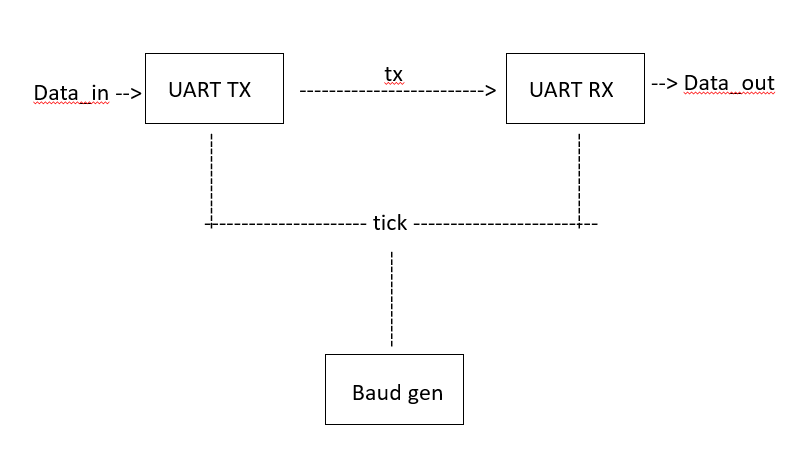

# UART Communication System using Verilog HDL

## Project Overview

This project implements a complete UART (Universal Asynchronous Receiver Transmitter) communication system using Verilog HDL. The design includes a UART Transmitter (TX), UART Receiver (RX), Baud Rate Generator, and a System-Level Testbench for simulation and verification.

The UART Transmitter converts 8-bit parallel data into serial data, while the UART Receiver reconstructs the serial data back into parallel form. The complete system was verified using waveform simulation in Xilinx Vivado.

---

# Features

- FSM-based UART Transmitter
- FSM-based UART Receiver
- Baud-rate tick generation
- Parallel-to-serial data conversion
- Serial-to-parallel data conversion
- Start bit and stop bit handling
- Shift-register-based receiver implementation
- End-to-end TX-RX communication verification
- Fully simulated and debugged in Vivado

---

# UART Frame Format

| Start Bit | Data Bits | Stop Bit |
|------------|------------|-----------|
|     0      | 8 Bits (LSB First) | 1 |

---

# Block Diagram

# Modules Description

## 1. uart_tx.v
UART Transmitter module.

### Functions:
- Accepts 8-bit parallel input data
- Converts data into serial format
- Generates start and stop bits
- Uses FSM for transmission control

### FSM States:
- IDLE
- START
- DATA
- STOP

---

## 2. uart_rx.v
UART Receiver module.

### Functions:
- Detects start bit
- Receives serial data
- Reconstructs 8-bit parallel data
- Uses shift register for serial-to-parallel conversion

### FSM States:
- IDLE
- START
- DATA
- STOP

---

## 3. baud_gen.v
Baud-rate tick generator module.

### Functions:
- Divides system clock
- Generates periodic tick pulse
- Controls UART timing

---

## 4. uart_system_tb.v
System-level testbench.

### Functions:
- Connects UART TX and RX
- Generates clock signal
- Verifies complete UART communication
- Produces simulation waveforms

---

# Simulation Results

The UART system successfully transmitted and received serial data.

### Example Verification

| Input Data | Output Data |
|-------------|-------------|
| 10101010 | 10101010 |

The received data matched the transmitted data successfully.

---

# Tools Used

- Verilog HDL
- Xilinx Vivado
- FSM Design Methodology

---

# Key Concepts Learned

- Finite State Machine (FSM) Design
- Sequential Logic Design
- UART Communication Protocol
- Baud Rate Timing
- Shift Registers
- RTL Design and Simulation
- Waveform Debugging

---

# Future Improvements

- Configurable baud rate
- Oversampling receiver
- Parity bit support
- FIFO integration
- FPGA implementation
- UART-to-PC communication

---

# Author

Aman Tyagi
